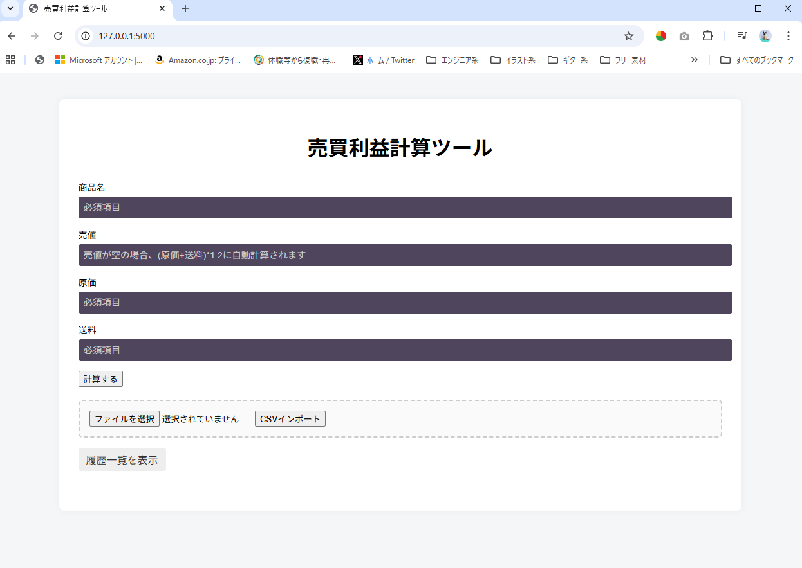

# MyResaleTool_Flask_v2
## フリマ出品前に利益を可視化するwebツール
メルカリやヤフオクの出品前に、  
赤字リスクを素早くチェックできる利益計算アプリです。   

## できること
- 赤字／低利益／出品候補の判定表示
- 商品名・売値・原価・送料の入力
- 利益・利益率の計算
- 履歴の参照と削除
- 入力値のcsvインポート
- 結果のcsvエクスポート

## 使用技術
- Python
- Flask

## 想定ユーザー
メルカリ・ヤフオク等で商品を仕入れて販売する個人出品車向けの、出品前の利益確認ツールです。

## 環境
- Python 3.10 以上
- Flask

## セットアップ
### 仮想環境作成
python -m venv venv

### 仮想環境有効化
Windows:
venv\Scripts\activate

Mac:
source venv/bin/activate

### 依存関係インストール
pip install -r requirements.txt

## フォルダ構成(仮想環境を作成した場所によって異なりますが以下を推奨)

  
flask/  
├ myenv/←上記コマンドで作成した仮想環境（こちらはGit管理しない）  
flask_test/    
├─docs  
│  └─****.png (実行時のスクリーンショット各種)    
├─logs  
│  └─app.log  
├─output  
│  └─download.csv  (download処理時の仮ファイル)  
│  └─test_input.csv (importテスト用のデータ)  
├─static  
│  └─css  
├─templates  
│  └ index.html  
│  └ history.html  
└─test  
│  └─logig_test.py  (未実装)
├ app.py  
├ logic.py  
└ requirements.txt  
└ .gitignore  

  

## 起動及び使用手順
python app.py

上記実行後、以下へコマンドラインに表示されるアドレス(以下デフォルト)へアクセス  
http://127.0.0.1:5000/  

### 使用手順
1. 商品名,価格,原価,送料の入力値を受け取り、利益,利益率を出し、出品対象となるかどうかの判定を行う。
	 価格が未入力の場合、(原価+送料)×1.2として自動計算する。  
2. 1の処理をcsvファイルによるインポートを行うことで、複数件同時に行うことができる。
3. 履歴をDBへINSERTする。またSELECT/DELETEすることができる。
4. 履歴をcsv形式でエクスポートすることができる。

## 簡易設計
app.py(flaskのエントリーインポート)
	∟index  
	∟history  
	∟delete_all  
	∟delete  
	∟download  
	∟import  
	
logic.py(CSV処理/計算及び判定/フィルタ・ソート機能)
	∟query_exe (DBへの接続とクエリの実行を行う)  
	∟check_table (DB内に対象のテーブルがあるか確認する(確認自体はCREATE TABLEコマンドを使用))    
	∟input_check(数値の正当性をチェック)    
	∟input_exe (入力値に対する処理)  
	∟history_filter_and_sort (ソート&フィルタを行ったSELECTの結果を返す)  
	∟select_exe(履歴を全て出力するSELECTコマンドを実行し結果を返す)  
	∟delete_exe(テーブル内の指定のデータを削除する)  
	∟download_exe(DB内の履歴をcsv形式でダウンロードする)  

## 関数のテスト(未実装)
簡単なテスト関数(手動確認用)も含まれます。コメントアウトによりON,OFFする想定です。  
ソースコード部分  
"if __name__ == "__main__":  
    test_judge()  # 確認したいときだけ有効化  
    app.run(debug=True)"  

## 実行イメージ
### 入力画面

#### その他のスクリーンショット
flask_test/docs/以下に格納  

### 備考
本ツールは学習目的で作成した個人開発アプリです。  

### 今後の改善

- これは理想20260220
- Tkinterについて(できるかどうか)
  標準ライブラリ tkinter をインポートするだけで、ボタンやラベル、ウィンドウなどを配置したデスクトップアプリケーションを、シンプルかつ高速に作成できる 。初心者からプロまで、迅速なプロトタイピングに最適
